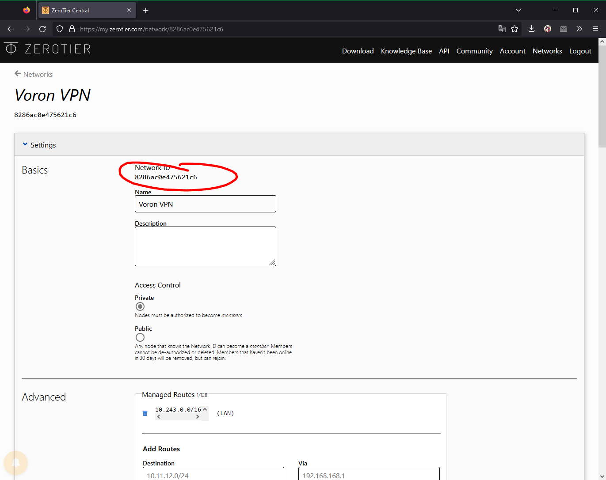
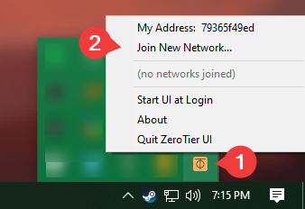
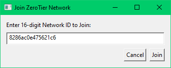
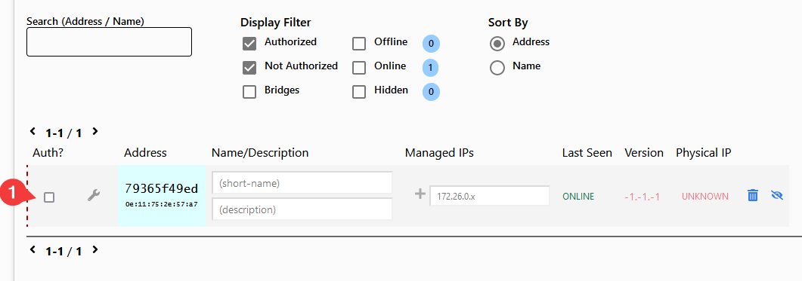
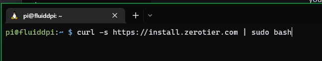
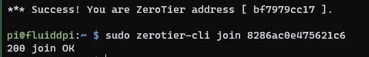
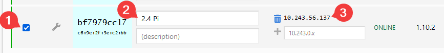
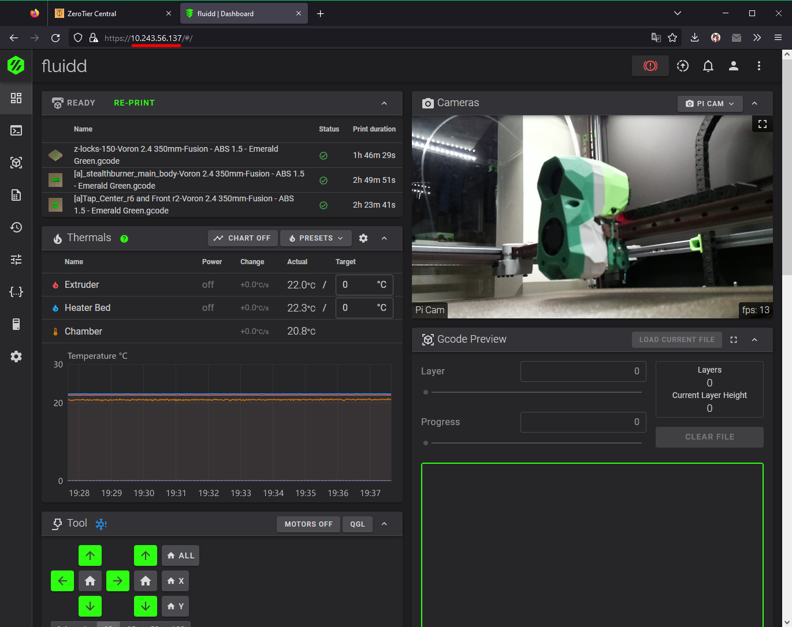

# Remote Access to your Voron with ZeroTier

A (very quick) video equivalent of these steps is available here: 

Prerequisites: 

* SSH access to your Pi & basic comfort with Linux CLI (mostly copy-pastable!) 
* An email
* A few minutes of your time

1. Create an account on the ZeroTier website, you can do so [here](https://my.zerotier.com/login).
2. Download & install the ZeroTier client on your client devices (phone, laptop - any device you want remote access to your printer from). You can find links & information about all the available clients [here](https://www.zerotier.com/download/).
3. In the [ZeroTier admin console](https://my.zerotier.com/network), select "Create a Network". Copy down the network ID. If you wish, you can name the network. In this instance, the network ID is `8286ac0e475621c6`. 
    
4. Select the ZeroTier tray icon (may be different on other clients!), then Join a Network. Enter the network ID we obtained in the last step, and hit enter.   
     
5. In the ZeroTier admin console, click on your network, then scroll towards the bottom. You will see a new device there that needs authentication. Click the authentication checkbox near the left-hand side. 
    
6. Switch to your Pi SSH session and run the following commands... 
   1. To install the ZeroTier client on your Pi, run the command: `curl -s https://install.zerotier.com | sudo bash` 
    
   2. If prompted, enter your sudo password & say yes to installing packages. 
   3. Once complete, if the installation was successful you should get an output alone the lines of: `Success! You are ZeroTier address [ YOURADDRESS ].` 
   4. To join the network, run the following command: `sudo zerotier-cli join YOUR_NETWORK_ID` 
    
7. As we did in step 5, authenticate the new, second client that needs authentication. You may want to add a name, in case you need to find the IP again in the future. Wait a few moments, and you should now be able to see the IP in the admin console (and in `ip addr` on SSH)
    
8. Copy down the Pi's IP address, toss it in your web browser (works for SSH, too!), and you should have remote access to your printer! 
    

